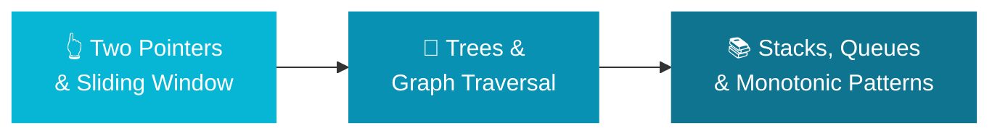

<div align="center">

# 🪨 AI Chisel — Intermediate DSA

### Carving Precision — Level 2 of the **Craft Engineering** track at [AI Educademy](https://aieducademy.org)

[](https://github.com/ai-educademy/ai-chisel/stargazers)
[](LICENSE)
[](https://github.com/ai-educademy/ai-chisel/pulls)
[](#-what-youll-learn)
[](#-craft-engineering-track)

**Level up with intermediate algorithmic patterns: two pointers, sliding window, BFS/DFS, trees, stacks, and monotonic patterns — each connected to real AI/ML applications.**

[🚀 Start Learning](https://aieducademy.org/programs/ai-chisel) · [📦 Platform Repo](https://github.com/ai-educademy/ai-platform) · [🎨 UI Library](https://github.com/ai-educademy/ai-ui-library)

---

</div>

## 📚 What You'll Learn

| # | Lesson | Duration | Topics |
|---|--------|----------|--------|
| 1 | Two Pointers & Sliding Window | 20 min | Two pointers on sorted arrays, sliding window for streams, O(n) optimisations |
| 2 | Trees & Graph Traversal | 25 min | Binary tree BFS/DFS, graph traversal, decision trees in AI |
| 3 | Stacks, Queues & Monotonic Patterns | 20 min | Stack/queue fundamentals, monotonic stack, sequence processing |

> **~6 hours** of total study time including practice problems.

## 🔍 Lesson Topics

<details>
<summary><strong>👆 Lesson 1 — Two Pointers & Sliding Window</strong></summary>

- Two Pointer pattern on sorted arrays
- Sliding Window for fixed & variable-size windows
- Real-world AI connection: streaming ML systems and real-time analytics
- Practice: pair sums, max subarray, minimum window substring

</details>

<details>
<summary><strong>🌲 Lesson 2 — Trees & Graph Traversal</strong></summary>

- Binary tree traversals: pre-order, in-order, post-order, level-order
- BFS and DFS on graphs
- Real-world AI connection: decision trees, knowledge graphs, neural network DAGs
- Practice: tree serialisation, shortest path, connected components

</details>

<details>
<summary><strong>📚 Lesson 3 — Stacks, Queues & Monotonic Patterns</strong></summary>

- Stack (LIFO) and Queue (FIFO) fundamentals
- Monotonic stack for next-greater-element problems
- Real-world AI connection: parsers, undo systems, sequence models
- Practice: valid parentheses, daily temperatures, sliding window maximum

</details>

## 🏗️ Craft Engineering Track

AI Chisel is **Level 2** of the 5-program Craft Engineering track:

| # | Program | Focus |
|---|---------|-------|
| 1 | [✏️ AI Sketch](https://github.com/ai-educademy/ai-sketch) | DSA Fundamentals — Arrays, Strings, Sorting |
| 2 | **[🪨 AI Chisel](https://github.com/ai-educademy/ai-chisel)** | **Intermediate DSA — Two Pointers, Trees, Stacks** ← you are here |
| 3 | [⚒️ AI Craft](https://github.com/ai-educademy/ai-craft) | System Design — URL Shortener, Rate Limiter, Recommendations |
| 4 | [💎 AI Polish](https://github.com/ai-educademy/ai-polish) | Behavioural Interviews — STAR Framework, Communication |
| 5 | [🏆 AI Masterpiece](https://github.com/ai-educademy/ai-masterpiece) | Career Capstone — Mock Interviews, Portfolio, Job Strategy |



## ✅ Prerequisites

- Complete [✏️ AI Sketch](https://github.com/ai-educademy/ai-sketch) or have equivalent DSA fundamentals (arrays, strings, sorting, hashing)
- Comfortable with Python or JavaScript
- Basic understanding of time/space complexity (Big-O)

## 🚀 How to Use

**Option 1 — Web platform (recommended)**

Visit [aieducademy.org/programs/ai-chisel](https://aieducademy.org/programs/ai-chisel) for the full interactive experience with progress tracking, illustrations, and quizzes.

**Option 2 — Browse directly**

Lessons are standard MDX files you can read right here on GitHub:

```
program.json                           # Program metadata
lessons/
└── en/
    ├── two-pointers-and-sliding-window.mdx
    ├── trees-and-graph-traversal.mdx
    └── stacks-queues-monotonic.mdx
public/
└── images/
    ├── two-pointers.svg
    ├── sliding-window.svg
    ├── tree-traversal.svg
    ├── graph-bfs-dfs.svg
    ├── stacks-queues.svg
    └── monotonic-stack.svg
```

## 🤝 Contributing

We welcome contributions! Here are some ways to help:

- **Fix typos or improve explanations** — open a PR
- **Add practice problems** — extend any lesson with new exercises
- **Translate** — create a new locale folder (e.g., `lessons/fr/`) and translate the MDX files
- **Improve diagrams** — SVGs live in `public/images/`

Please keep PRs focused and follow the existing MDX frontmatter format.

## 📄 License

MIT © [AI Educademy Contributors](https://github.com/ai-educademy)

---

<div align="center">

**Part of [AI Educademy](https://aieducademy.org)** — Free, open-source AI & engineering education for everyone.

[🌐 Platform](https://github.com/ai-educademy/ai-platform) · [🎨 UI Library](https://github.com/ai-educademy/ai-ui-library) · [🌱 All Programs](https://github.com/ai-educademy)

</div>
