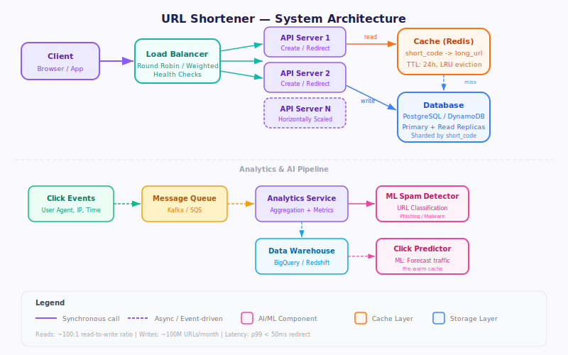
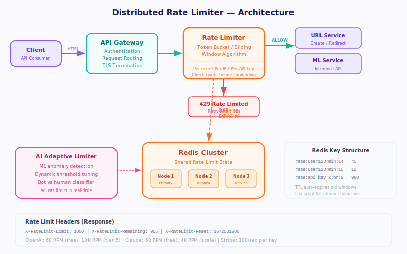
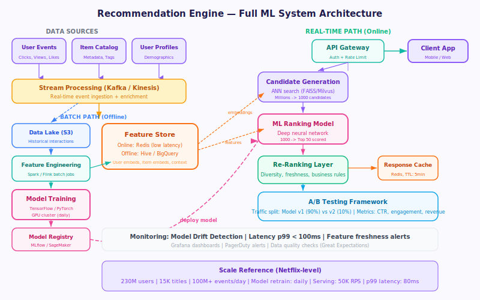
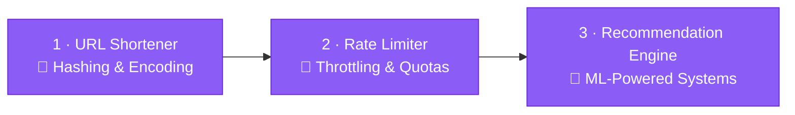

# ⚒️ AI Craft — System Design

> **Level 3** of the **Craft Engineering** track at [AI Educademy](https://aieducademy.vercel.app)

Design large-scale systems that power AI: recommendation engines, URL shorteners, rate limiters.
Learn to think in **architectures**, not just code.

---

## 📚 What You'll Learn

| # | Lesson | Topics |
|---|--------|--------|
| 1 | [Design a URL Shortener](lessons/en/design-url-shortener.mdx) | Hashing, Base62 encoding, read-heavy systems, caching |
| 2 | [Design a Rate Limiter](lessons/en/design-rate-limiter.mdx) | Token bucket, sliding window, distributed rate limiting |
| 3 | [Design a Recommendation Engine](lessons/en/design-recommendation-engine.mdx) | Collaborative filtering, content-based, hybrid approaches |

**Estimated time:** ~8 hours &nbsp;·&nbsp; **Audience:** Mid-to-senior engineers preparing for system design rounds

---

## 🗂️ Lesson Topics

<strong>1 · Design a URL Shortener</strong>

- Requirements gathering & capacity estimation
- Base62 / Base58 encoding strategies
- Database schema design (SQL vs NoSQL)
- Read-heavy architecture with caching layers
- Collision handling & custom aliases
- Analytics and click tracking

<strong>2 · Design a Rate Limiter</strong>

- Token bucket & leaky bucket algorithms
- Fixed window vs sliding window counters
- Distributed rate limiting with Redis
- API gateway integration
- Rate limit headers & client communication
- Graceful degradation strategies

<strong>3 · Design a Recommendation Engine</strong>

- Collaborative filtering (user-based & item-based)
- Content-based filtering with feature extraction
- Hybrid recommendation approaches
- Real-time vs batch processing pipelines
- Cold start problem & solutions
- A/B testing recommendation quality

---

## 🛤️ Craft Engineering Track

AI Craft is part of the **Craft Engineering** learning path — five progressive programs
that take you from coding fundamentals to mastery:

| Level | Program | Focus |
|-------|---------|-------|
| 1 | [✏️ Sketch](https://github.com/ai-educademy/ai-sketch) | Foundations — Arrays, Strings, Sorting |
| 2 | [🪨 Chisel](https://github.com/ai-educademy/ai-chisel) | Sharpening Skill — Trees, Graphs, DP |
| **3** | **⚒️ Craft** (you are here) | **Building Skill — System Design** |
| 4 | [💎 Polish](https://github.com/ai-educademy/ai-polish) | Refining Skill — Behavioural & Leadership |
| 5 | [🏆 Masterpiece](https://github.com/ai-educademy/ai-masterpiece) | Interview Excellence — Mock Interviews |

---

## ✅ Prerequisites

- Complete **[AI Chisel](https://github.com/ai-educademy/ai-chisel)** (Level 2), or have a solid foundation in data structures & algorithms
- Comfortable with at least one programming language
- Basic understanding of databases, APIs, and networking

---

## 🚀 How to Use

1. **Online:** Visit [aieducademy.vercel.app](https://aieducademy.vercel.app) for the full interactive experience with progress tracking
2. **Offline:** Browse the MDX lesson files directly in [`lessons/en/`](lessons/en/) — they're readable as-is

Each lesson follows a structured format:
- 🎯 **Requirements** — clarify the problem
- 🏗️ **High-Level Design** — define components and APIs
- 📐 **Deep Dive** — walk through algorithms and trade-offs
- 📊 **Scaling** — handle growth and bottlenecks

---

## 🤝 Contributing

Contributions are welcome! Whether it's fixing a typo, improving a diagram, or adding a new lesson:

1. Fork the repository
2. Create a feature branch (`git checkout -b feature/improve-rate-limiter`)
3. Commit your changes
4. Open a Pull Request

Please see the [AI Educademy org](https://github.com/ai-educademy) for contribution guidelines.

---

## 📄 License

This project is licensed under the **MIT License** — see the [LICENSE](LICENSE) file for details.

---

**Part of [AI Educademy](https://aieducademy.vercel.app)** · Built with ❤️ by the community

[🌐 Platform](https://aieducademy.vercel.app) · [🏫 Organization](https://github.com/ai-educademy) · [⭐ Star this repo](https://github.com/ai-educademy/ai-craft)

