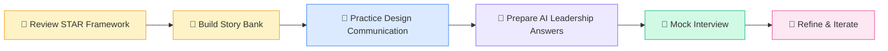

<div align="center">

# 💎 AI Polish — Behavioral Interview Mastery

**Refining Excellence — Structured Frameworks for Behavioral Rounds**

Part of the **Craft Engineering** track at [AI Educademy](https://aieducademy.vercel.app)

[](https://github.com/ai-educademy/ai-polish/stargazers)
[](LICENSE)
[](https://github.com/ai-educademy/ai-polish/pulls)
[](#craft-engineering-track)
[](https://github.com/ai-educademy)

</div>

---

## 📚 What You'll Learn

Master the behavioral interview with structured frameworks — from STAR storytelling to system design communication to leading teams through the AI era.

| # | Lesson | Duration | Difficulty |
|---|--------|----------|------------|
| 1 | ⭐ The STAR Framework — Structure Your Stories | 15 min | Beginner |
| 2 | 💬 Communicating System Design — Think Out Loud | 20 min | Intermediate |
| 3 | 🧭 AI-Era Leadership — Navigate the New Normal | 20 min | Intermediate |

**Estimated total time: ~4 hours** (including practice exercises)

---

## 🎯 Lesson Topics

<details>
<summary><strong>⭐ Lesson 1 — The STAR Framework</strong></summary>

Learn the universal skeleton for behavioral answers. Structure compelling stories about your engineering impact using **Situation → Task → Action → Result**.

- Why structure beats storytelling
- Good vs bad STAR answers
- Building your personal story bank
- Quantifying results for engineering roles
- Framework diagrams: `star-framework.svg`, `star-bank.svg`

</details>

<details>
<summary><strong>💬 Lesson 2 — System Design Communication</strong></summary>

System design interviews test **how you think**, not just what you know. Master the art of thinking out loud and structuring your presentation.

- The 4-phase interview timeline: Clarify → High-Level → Deep Dive → Wrap Up
- Communication frameworks for technical decisions
- Handling ambiguity and trade-off discussions
- Framework diagrams: `design-interview-flow.svg`, `design-communication.svg`

</details>

<details>
<summary><strong>🧭 Lesson 3 — AI-Era Leadership</strong></summary>

Prepare for leadership questions in the age of AI — ethics, build-vs-buy decisions, team upskilling, and responsible AI strategy.

- Common AI-era behavioral questions
- Build vs buy decision frameworks
- AI ethics and responsible deployment
- Leading teams through AI transformation
- Framework diagrams: `build-vs-buy.svg`, `ai-ethics-framework.svg`

</details>

---

## 🏗️ Craft Engineering Track

AI Polish is **Level 4** in the five-program Craft Engineering track:

| Level | Program | Focus |
|-------|---------|-------|
| 1 | [✏️ Sketch](https://github.com/ai-educademy/ai-sketch) | Foundations — Data Structures & Patterns |
| 2 | [🪨 Chisel](https://github.com/ai-educademy/ai-chisel) | Shaping — Algorithm Problem-Solving |
| 3 | [⚒️ Craft](https://github.com/ai-educademy/ai-craft) | Building — System Design Mastery |
| 4 | **[💎 Polish](https://github.com/ai-educademy/ai-polish)** | **Refining — Behavioral Interview Mastery** |
| 5 | [🏆 Masterpiece](https://github.com/ai-educademy/ai-masterpiece) | Perfecting — Mock Interviews & Synthesis |



---

## 📋 Prerequisites

- Complete [⚒️ AI Craft](https://github.com/ai-educademy/ai-craft) or have equivalent system design experience
- Real project experience to draw stories from
- Familiarity with common behavioral question categories

---

## 🚀 How to Use

**Option 1 — Web Platform (Recommended)**

Visit **[aieducademy.vercel.app](https://aieducademy.vercel.app)** for the full interactive experience with progress tracking and AI-assisted practice.

**Option 2 — Browse Locally**

Lessons are self-contained MDX files you can read directly:

```bash
git clone https://github.com/ai-educademy/ai-polish.git
cd ai-polish/lessons/en
```

| File | Lesson |
|------|--------|
| [`star-framework.mdx`](lessons/en/star-framework.mdx) | The STAR Framework |
| [`system-design-communication.mdx`](lessons/en/system-design-communication.mdx) | System Design Communication |
| [`ai-era-leadership.mdx`](lessons/en/ai-era-leadership.mdx) | AI-Era Leadership |

SVG framework diagrams are in [`public/images/`](public/images/).

---

## 🤝 Contributing

Contributions are welcome! Here's how you can help:

1. **Fix typos or improve clarity** — open a PR directly
2. **Add new examples or scenarios** — open an issue first to discuss
3. **Translate lessons** — create a new folder under `lessons/` (e.g., `lessons/es/`)
4. **Suggest new diagrams** — SVG format preferred

Please read the [AI Educademy contributing guidelines](https://github.com/ai-educademy) before submitting.

---

## 📄 License

This project is licensed under the [MIT License](LICENSE).

---

<div align="center">

**[AI Educademy](https://aieducademy.vercel.app)** · [GitHub Org](https://github.com/ai-educademy) · Made with ❤️ for engineers everywhere

</div>
