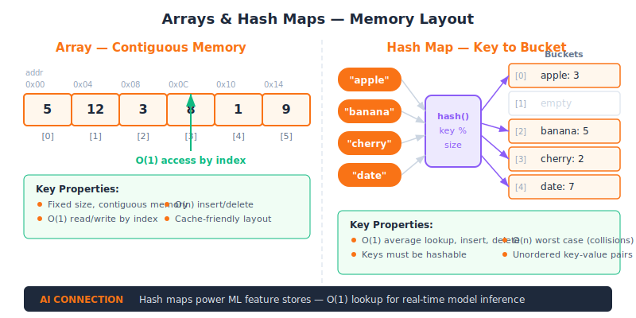
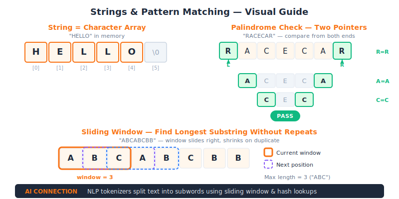
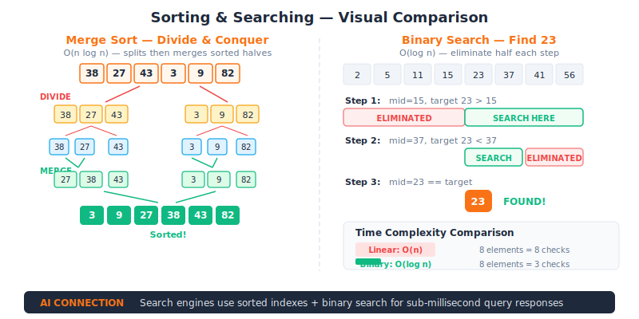

<div align="center">

# ✏️ AI Sketch — DSA Fundamentals

**Rough Outlines — Master the building blocks of Data Structures & Algorithms**

Part of the **Craft Engineering** track at [AI Educademy](https://aieducademy.vercel.app)

[](https://github.com/ai-educademy/ai-sketch)
[](LICENSE)
[](https://github.com/ai-educademy/ai-sketch/pulls)
[](https://aieducademy.vercel.app)
[](https://aieducademy.vercel.app)

[**🚀 Start Learning**](https://aieducademy.vercel.app) · [**🌐 Platform**](https://github.com/ai-educademy/ai-platform) · [**🏗️ All Programs**](https://github.com/ai-educademy)

</div>

---

## 📚 What You'll Learn

This is **Level 1** of the Craft Engineering track — three visual, beginner-friendly lessons covering the DSA fundamentals that power AI systems.

| # | Lesson | Topics |
|---|--------|--------|
| 1 | [Arrays & Hashing](lessons/en/arrays-and-hashing.mdx) | Arrays, hash maps, frequency counting, two-sum patterns |
| 2 | [Strings & Pattern Matching](lessons/en/strings-and-patterns.mdx) | String manipulation, sliding window, NLP tokenisation |
| 3 | [Sorting & Searching](lessons/en/sorting-and-searching.mdx) | Sorting algorithms, binary search, ranking in ML |

> **Estimated time:** ~4 hours · **Difficulty:** Beginner

---

## 🔍 Lesson Topics

<details>
<summary><strong>1 · Arrays & Hashing — The Building Blocks of AI</strong></summary>

Master arrays and hash maps through visual patterns. See how recommendation engines and search indexes use these fundamental structures.

- Array traversal and manipulation
- Hash map operations and collision handling
- Frequency counting patterns
- Two-sum and prefix-sum techniques
- Real-world AI applications: search indexes, feature vectors



</details>

<details>
<summary><strong>2 · Strings & Pattern Matching — How AI Reads Text</strong></summary>

Understand string manipulation and pattern matching. Discover how NLP tokenizers and search engines process text.

- String reversal, palindromes, anagrams
- Sliding window technique
- Pattern matching fundamentals
- Tokenisation for NLP
- Real-world AI applications: text processing, search engines



</details>

<details>
<summary><strong>3 · Sorting & Searching — How AI Ranks Results</strong></summary>

Visualise sorting algorithms and binary search. See how search engines rank results and how ML models use sorted data.

- Bubble, merge, and quick sort
- Binary search and its variants
- Time complexity analysis
- Sorting in practice: databases, rankings
- Real-world AI applications: recommendation ranking, nearest-neighbour search



</details>

---

## 🏗️ Craft Engineering Track

The Craft Engineering track takes you from DSA fundamentals to career-ready engineering skills across **5 progressive programs**:

```
✏️ Sketch → 🪨 Chisel → ⚒️ Craft → 💎 Polish → 🏆 Masterpiece
```

| Level | Program | Focus | Status |
|-------|---------|-------|--------|
| 1 | [✏️ AI Sketch](https://github.com/ai-educademy/ai-sketch) | DSA Fundamentals | ✅ **You are here** |
| 2 | [🪨 AI Chisel](https://github.com/ai-educademy/ai-chisel) | Intermediate DSA | 🚧 Coming soon |
| 3 | [⚒️ AI Craft](https://github.com/ai-educademy/ai-craft) | System Design | 🚧 Coming soon |
| 4 | [💎 AI Polish](https://github.com/ai-educademy/ai-polish) | Behavioral Interviews | 🚧 Coming soon |
| 5 | [🏆 AI Masterpiece](https://github.com/ai-educademy/ai-masterpiece) | Career Capstone | 🚧 Coming soon |

---

## 🗺️ Lesson Flow


---

## 📋 Prerequisites

- **Basic programming** in any language (Python, JavaScript, Java, etc.)
- Familiarity with variables, loops, and functions
- No prior DSA knowledge required — we start from scratch!

---

## 🚀 How to Use

### Option 1: Online (Recommended)

Visit **[aieducademy.vercel.app](https://aieducademy.vercel.app)** for the full interactive experience with progress tracking, dark mode, and multilingual support.

### Option 2: Browse Locally

The lessons are standard MDX files — read them directly on GitHub or clone this repo:

```bash
git clone https://github.com/ai-educademy/ai-sketch.git
cd ai-sketch/lessons/en
# Open any .mdx file in your editor
```

---

## 🤝 Contributing

Contributions are welcome! Here's how you can help:

1. **Fix typos or improve explanations** — open a PR
2. **Add diagrams or examples** — visual learning is our strength
3. **Translate lessons** — help make DSA education accessible worldwide
4. **Report issues** — found something confusing? Let us know

Please see the [AI Educademy contribution guidelines](https://github.com/ai-educademy/.github) for details.

---

## 📄 License

This project is licensed under the [MIT License](LICENSE).

---

<div align="center">

Made with ❤️ by the [AI Educademy](https://github.com/ai-educademy) community

[🌐 Platform](https://aieducademy.vercel.app) · [🎨 UI Library](https://github.com/ai-educademy/ai-ui-library) · [📦 npm](https://www.npmjs.com/package/@ai-educademy/ai-ui-library)

</div>
